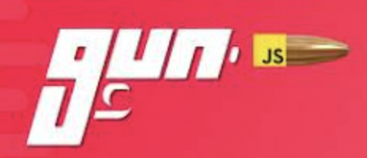

# Discord Blockchain Clone 👋

Based on youtube tutorial [Build Discord Web 3.0 Real-Time Decentralized Chat App with Next.js | Sanity.io | Gun.js](https://www.youtube.com/watch?v=ZsV-jDk7dS8)

<!--  -->
  
     Discord
      
    
  
   
     
    <a href="https://github.com/brenfondeadora/discord-clone-blockchain/issues/new">Report bug</a>
    ·
    <a href="https://github.com/brenfondeadora/discord-clone-blockchain/issues/new">Request feature</a>

  
   
    
      
  

## 🤖 Requirements

## ✨ TODO

 

## 👤 Author

**Brenda Saavedra**

- WebPage: [brendasaavedra.com](http://brendasaavedra.com)
- Github: [@brenfondeadora](https://github.com/brenfondeadora/)

 

## 📝 License

Copyright © 2022 [Brenda Saavedra](https://github.com/brenfondeadora). 
This project is [MIT License](LICENSE)
